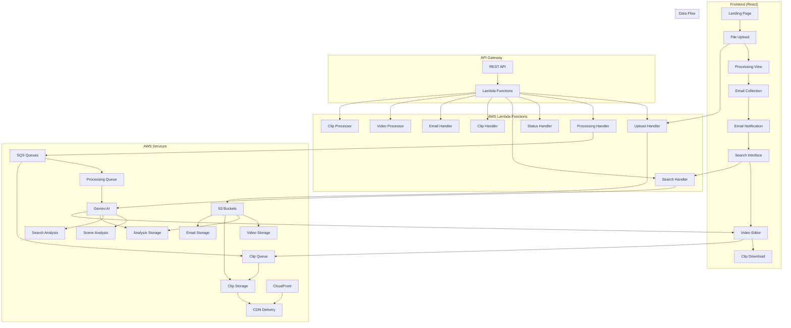
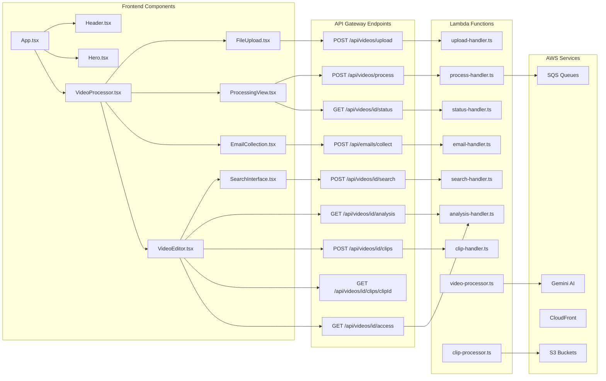
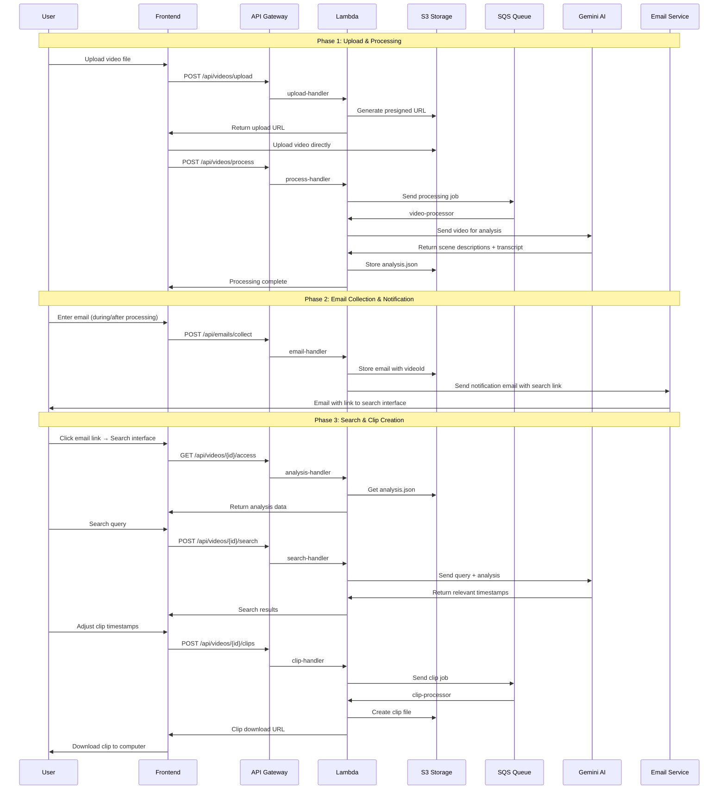

# Video Clipper - AI-Powered Video Search & Clipping Application

## Table of Contents
1. [Application Overview](#application-overview)
2. [User Journey](#user-journey)
3. [Backend Architecture](#backend-architecture)
4. [API Endpoints](#api-endpoints)
5. [Data Models](#data-models)
6. [Frontend Components](#frontend-components)
7. [AWS Services Configuration](#aws-services-configuration)
8. [Security & Performance](#security--performance)
9. [Implementation Roadmap](#implementation-roadmap)

---

## Application Overview

### What is Video Clipper?

Video Clipper is an AI-powered web application that transforms long videos into searchable, clip-able content. Users upload videos, and the application uses Google's Gemini AI to analyze the content, making it possible to find specific moments through natural language search and create precise clips instantly.

### Core Problem Solved

Traditional video editing requires manual scrubbing through hours of footage to find specific moments. Video Clipper eliminates this by:
- **AI Scene Analysis**: Automatically describes what's happening in each scene
- **Transcript Generation**: Converts speech to searchable text with timestamps
- **Natural Language Search**: Find content using everyday language
- **Instant Clipping**: Create clips with precise start/end times

### Key Features

- **No Authentication Required**: Simple email collection for lead generation
- **AI-Powered Analysis**: Gemini Pro Vision for scene descriptions and speech-to-text
- **Natural Language Search**: "person walking dog", "sunset over mountains", "when they said hello"
- **Precise Timestamp Selection**: AI suggests exact start/end times for clips
- **Multiple Clip Formats**: MP4 output with customizable quality
- **Real-time Processing Status**: Live progress updates during analysis
- **Search Analytics**: Track what users search for to improve the product

### Target Use Cases

- **Content Creators**: Find specific moments in long recordings
- **Educators**: Extract key teaching moments from lectures
- **Researchers**: Analyze video data for specific events
- **Journalists**: Find quotes and moments in interviews
- **Personal Videos**: Organize and find moments in family videos

---

## User Journey

### Detailed User Flow

1. **Landing Page**: User learns about the app's capabilities
2. **Video Upload**: User uploads a video file (MP4, AVI, MOV, WMV, MKV, WEBM)
3. **Processing View**: User sees their video being processed with real-time progress
4. **Email Collection**: 
   - User can enter email during processing and wait
   - User can enter email and leave (get notified when done)
   - If no email entered and processing finishes while user is still on page, prompt for email
5. **Email Notification**: User receives email with link to search interface
6. **Search Interface**: User clicks email link and accesses video with analysis
7. **Search & Results**: User searches, Gemini returns relevant timestamps
8. **Video Editor**: User views video, adjusts clip timestamps, creates clip
9. **Download**: User downloads the created clip to their computer

### Key User Experience Details

- **Processing Page**: Real-time progress with option to enter email anytime
- **Email Flexibility**: Can enter email during processing or after completion
- **Email Link Access**: Direct link to search interface (no re-upload needed)
- **Persistent Video Access**: Once processed, video remains accessible via email link
- **Interactive Timeline**: Drag handles to adjust clip start/end times
- **Direct Download**: Clips download directly to user's computer

---

## Backend Architecture

### Architecture Overview



### Component Architecture



### Data Flow Architecture



---

## API Endpoints

### Video Processing Endpoints

#### POST /api/videos/upload
Generate presigned S3 URL for direct video upload.

**Request:**
```json
{
  "fileName": "video.mp4",
  "fileSize": 52428800,
  "contentType": "video/mp4"
}
```

**Response:**
```json
{
  "success": true,
  "uploadUrl": "https://s3.amazonaws.com/...",
  "videoId": "vid_123456",
  "expiresIn": 3600
}
```

#### POST /api/videos/process
Start video processing pipeline.

**Request:**
```json
{
  "videoId": "vid_123456",
  "userEmail": "user@example.com"
}
```

**Response:**
```json
{
  "success": true,
  "processingId": "proc_123",
  "estimatedTime": 120,
  "emailRequired": false
}
```

#### GET /api/videos/{videoId}/status
Check processing status and email requirements.

**Response:**
```json
{
  "videoId": "vid_123456",
  "status": "completed",
  "progress": 100,
  "emailRequired": true,
  "emailCollected": false,
  "searchLink": "https://app.example.com/search/vid_123456?token=abc123"
}
```

#### GET /api/videos/{videoId}/analysis
Get initial analysis results (scene descriptions + transcript).

**Response:**
```json
{
  "videoId": "vid_123456",
  "duration": 120.5,
  "sceneDescriptions": [
    {
      "timestamp": 5.2,
      "description": "Person walking through a park",
      "confidence": 0.95,
      "tags": ["person", "walking", "park"]
    }
  ],
  "transcript": [
    {
      "timestamp": 2.1,
      "text": "Welcome to our video tutorial",
      "confidence": 0.98,
      "speaker": "speaker_1"
    }
  ],
  "metadata": {
    "resolution": "1920x1080",
    "fps": 30,
    "codec": "H.264"
  }
}
```

### Email Collection Endpoints

#### POST /api/emails/collect
Collect user email for notifications and search access.

**Request:**
```json
{
  "email": "user@example.com",
  "videoId": "vid_123456",
  "source": "processing_page"
}
```

**Response:**
```json
{
  "success": true,
  "message": "Email collected successfully",
  "searchLink": "https://app.example.com/search/vid_123456?token=abc123",
  "emailSent": true
}
```

### Search Interface Endpoints

#### GET /api/videos/{videoId}/access
Validate access token and return video analysis.

**Request:**
```
GET /api/videos/vid_123456/access?token=abc123
```

**Response:**
```json
{
  "success": true,
  "videoId": "vid_123456",
  "accessGranted": true,
  "analysis": {
    "duration": 120.5,
    "sceneDescriptions": [...],
    "transcript": [...]
  },
  "videoUrl": "https://cdn.example.com/videos/vid_123456/original.mp4"
}
```

#### POST /api/videos/{videoId}/search
Search video content using Gemini AI.

**Request:**
```json
{
  "query": "person walking dog",
  "searchType": "both"
}
```

**Response:**
```json
{
  "results": [
    {
      "type": "scene",
      "timestamp": 15.8,
      "startTime": 12.5,
      "endTime": 18.2,
      "description": "Person walking dog in park",
      "confidence": 0.95,
      "relevance": "High match for 'person walking dog'"
    },
    {
      "type": "transcript",
      "timestamp": 16.2,
      "startTime": 15.8,
      "endTime": 17.5,
      "text": "Look at the dog walking with its owner",
      "confidence": 0.92,
      "relevance": "Mentions 'dog walking'"
    }
  ],
  "suggestedClips": [
    {
      "clipId": "suggested_1",
      "startTime": 12.5,
      "endTime": 18.2,
      "description": "Dog walking scene",
      "reasoning": "Best match for 'person walking dog' query"
    }
  ]
}
```

### Clip Creation Endpoints

#### POST /api/videos/{videoId}/clips
Create video clip from selected timestamps.

**Request:**
```json
{
  "startTime": 12.5,
  "endTime": 18.2,
  "name": "Dog walking clip",
  "source": "search_result"
}
```

**Response:**
```json
{
  "success": true,
  "clipId": "clip_789",
  "status": "processing",
  "estimatedTime": 30
}
```

#### GET /api/videos/{videoId}/clips/{clipId}
Get clip status and download URL.

**Response:**
```json
{
  "clipId": "clip_789",
  "videoId": "vid_123456",
  "startTime": 12.5,
  "endTime": 18.2,
  "duration": 5.7,
  "name": "Dog walking clip",
  "status": "completed",
  "downloadUrl": "https://cdn.example.com/clips/clip_789.mp4",
  "fileSize": 5242880,
  "format": "mp4"
}
```

---

## Data Models

### Video Analysis JSON Structure
```json
{
  "videoId": "vid_123456",
  "analysisDate": "2024-01-15T10:05:00Z",
  "status": "completed",
  "duration": 120.5,
  "metadata": {
    "resolution": "1920x1080",
    "fps": 30,
    "codec": "H.264",
    "fileSize": 52428800
  },
  "sceneDescriptions": [
    {
      "timestamp": 5.2,
      "description": "Person walking through a park",
      "confidence": 0.95,
      "tags": ["person", "walking", "park", "outdoor"]
    }
  ],
  "transcript": [
    {
      "timestamp": 2.1,
      "text": "Welcome to our video tutorial",
      "confidence": 0.98,
      "speaker": "speaker_1"
    }
  ],
  "summary": {
    "mainTopics": ["video editing", "tutorial", "learning"],
    "keyMoments": [15.8, 45.2, 78.9],
    "overallSentiment": "positive"
  },
  "processingInfo": {
    "modelUsed": "gemini-pro-vision",
    "processingTime": 45.2,
    "cost": 0.023
  }
}
```

### Clip Metadata Structure
```json
{
  "clipId": "clip_789",
  "videoId": "vid_123456",
  "startTime": 12.5,
  "endTime": 18.2,
  "duration": 5.7,
  "name": "Dog walking clip",
  "source": "search_result",
  "status": "completed",
  "s3Key": "clips/clip_789/clip.mp4",
  "cloudfrontUrl": "https://cdn.example.com/clips/clip_789/clip.mp4",
  "fileSize": 5242880,
  "format": "mp4",
  "createdAt": "2024-01-15T10:30:00Z",
  "updatedAt": "2024-01-15T10:32:00Z"
}
```

### Email Collection JSON Structure
```json
{
  "emails": [
    {
      "email": "user@example.com",
      "videoId": "vid_123456",
      "sources": ["processing_page", "completion_prompt"],
      "videoIds": ["vid_123456"],
      "collectedAt": "2024-01-15T10:00:00Z",
      "lastUpdated": "2024-01-15T10:05:00Z",
      "searchLink": "https://app.example.com/search/vid_123456?token=abc123",
      "emailSent": true,
      "emailSentAt": "2024-01-15T10:05:00Z"
    }
  ]
}
```

### Video Access Token Structure
```json
{
  "videoId": "vid_123456",
  "token": "abc123",
  "email": "user@example.com",
  "createdAt": "2024-01-15T10:05:00Z",
  "expiresAt": "2024-01-15T18:05:00Z",
  "accessCount": 1
}
```

---

## Frontend Components

### Component Hierarchy
```
App.tsx
├── Header.tsx
├── Hero.tsx
├── VideoProcessor.tsx
│   ├── FileUpload.tsx
│   ├── ProcessingView.tsx
│   ├── EmailCollection.tsx
│   └── VideoEditor.tsx
│       └── SearchInterface.tsx
├── Features.tsx
├── HowItWorks.tsx
├── CTA.tsx
└── Footer.tsx
```

### Key Component Responsibilities

#### ProcessingView.tsx
- Display real-time processing progress
- Handle email collection during/after processing
- Show processing completion status
- Prompt for email if not provided

#### SearchInterface.tsx
- Load and display video analysis data
- Handle search queries
- Display search results with timestamps
- Allow selection of suggested clips

#### VideoEditor.tsx
- Display video player with controls
- Show interactive timeline with clip selection
- Handle clip timestamp adjustments
- Trigger clip creation process

---

## AWS Services Configuration

### S3 Bucket Structure
```
video-clipper-bucket/
├── videos/
│   └── {videoId}/
│       ├── original.mp4
│       ├── analysis.json
│       ├── metadata.json
│       └── thumbnail.jpg
├── clips/
│   └── {clipId}/
│       ├── clip.mp4
│       └── metadata.json
├── searches/
│   └── {videoId}/
│       └── search-history.json
└── emails/
    └── collected-emails.json
```

### SQS Queue Configuration
```json
{
  "ProcessingQueue": {
    "QueueName": "video-processing-queue",
    "VisibilityTimeoutSeconds": 900,
    "MessageRetentionPeriod": 1209600,
    "ReceiveMessageWaitTimeSeconds": 20
  },
  "ClipQueue": {
    "QueueName": "clip-processing-queue",
    "VisibilityTimeoutSeconds": 300,
    "MessageRetentionPeriod": 1209600,
    "ReceiveMessageWaitTimeSeconds": 20
  }
}
```

### CloudFront Distribution
```json
{
  "Origins": [
    {
      "Id": "S3-Origin",
      "DomainName": "video-clipper-bucket.s3.amazonaws.com",
      "S3OriginConfig": {
        "OriginAccessIdentity": ""
      }
    }
  ],
  "DefaultCacheBehavior": {
    "TargetOriginId": "S3-Origin",
    "ViewerProtocolPolicy": "redirect-to-https",
    "CachePolicyId": "4135ea2d-6df8-44a3-9df3-4b5a84be39ad",
    "Compress": true
  }
}
```

### Lambda Functions Specification

#### upload-handler.ts
- Generate presigned S3 URLs for direct video upload
- Create initial video metadata
- Validate file types and sizes

#### process-handler.ts
- Start video processing pipeline
- Send messages to SQS processing queue
- Update processing status

#### search-handler.ts
- Load video analysis from S3
- Create Gemini prompts with user queries
- Parse and return search results
- Store search analytics

#### video-processor.ts
- Process videos with Gemini AI
- Generate scene descriptions and transcripts
- Store analysis results in S3
- Send completion notifications

#### clip-processor.ts
- Create video clips using FFmpeg
- Upload clips to S3
- Generate CloudFront URLs
- Update clip metadata

---

## Security & Performance

### Security Considerations
- **CORS Configuration**: Restrict to frontend domain
- **S3 Bucket Policies**: Private access with presigned URLs
- **API Gateway Rate Limiting**: Prevent abuse
- **Lambda IAM Roles**: Least privilege principle
- **Data Encryption**: At rest and in transit
- **Access Tokens**: Time-limited tokens for video access

### Performance Optimizations
- **CloudFront Caching**: Cache analysis results and clips
- **S3 Lifecycle Policies**: Move old data to cheaper storage
- **Lambda Timeout Optimization**: Efficient function execution
- **SQS Batch Processing**: Process multiple items together
- **CDN Optimization**: Serve videos efficiently

### Cost Optimization
- **S3 Storage Classes**: Use appropriate storage tiers
- **Lambda Memory**: Optimize for processing speed vs cost
- **CloudFront Edge Locations**: Choose optimal regions
- **SQS Message Retention**: Configure appropriate timeouts

---

## Implementation Roadmap

### Phase 1: Core Infrastructure (Week 1-2)
1. Set up AWS services (S3, SQS, Lambda, API Gateway)
2. Implement basic upload and processing pipeline
3. Create email collection system
4. Deploy frontend with basic functionality

### Phase 2: AI Integration (Week 3-4)
1. Integrate Gemini AI for video analysis
2. Implement search functionality
3. Add clip creation pipeline
4. Test end-to-end workflow

### Phase 3: Optimization (Week 5-6)
1. Add CloudFront CDN
2. Implement caching strategies
3. Optimize performance and costs
4. Add analytics and monitoring

### Phase 4: Enhancement (Week 7-8)
1. Add user authentication (if needed)
2. Implement advanced search features
3. Add batch processing capabilities
4. Create admin dashboard

### Success Metrics
- **Processing Time**: < 2 minutes for 5-minute videos
- **Search Accuracy**: > 90% relevant results
- **User Engagement**: > 70% email collection rate
- **Clip Creation**: < 30 seconds for clip generation
- **Cost Efficiency**: < $0.10 per video processed

---

## Technical Requirements

### Frontend Requirements
- React 18+ with TypeScript
- Tailwind CSS for styling
- Lucide React for icons
- Shadcn/ui components

### Backend Requirements
- Node.js 18+ for Lambda functions
- AWS SDK v3
- Google Generative AI SDK
- FFmpeg for video processing

### Infrastructure Requirements
- AWS Account with appropriate permissions
- Google Cloud Project with Gemini API access
- Domain name for production deployment
- SSL certificate for HTTPS

### Development Environment
- Node.js 18+
- AWS CLI configured
- Docker for local development
- Git for version control

---

This design document provides a comprehensive blueprint for building the Video Clipper application with a focus on user experience, scalability, and cost-effectiveness.
